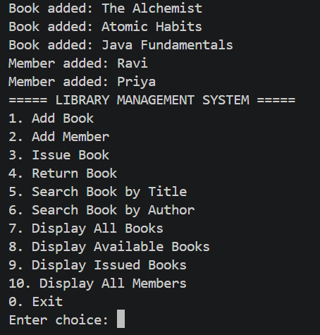
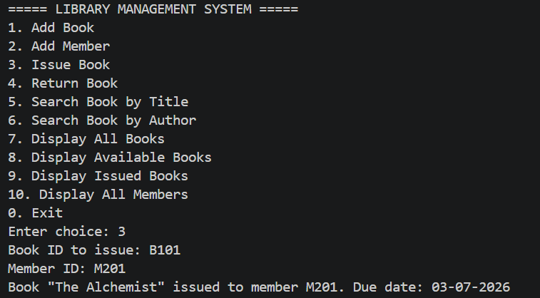
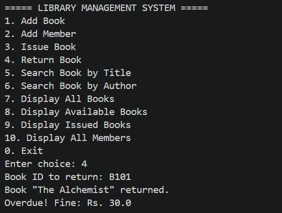
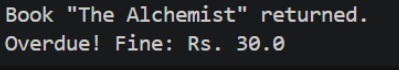

# 📚 Library Management System


A **console-based Library Management System** developed using **Core Java**. This project demonstrates **Object-Oriented Programming (OOP)**, **Collections Framework**, **Exception Handling**, and the **Java Date & Time API** by simulating real-world library operations.

---

# ✨ Features

- 📖 Add new books
- 👤 Register library members
- 📚 Issue books
- 🔄 Return books
- 💰 Automatic overdue fine calculation
- 🔍 Search books by title
- ✍️ Search books by author
- 📋 Display all books
- ✅ Display available books
- 📕 Display issued books
- 👥 Display all registered members
- ⚠️ Custom exception handling

---

# 🛠 Technologies Used

- Java
- Object-Oriented Programming (OOP)
- Collections Framework
- Exception Handling
- Java Date & Time API
- ArrayList
- HashMap

---

# 📚 Java Concepts Implemented

| Concept | Implementation |
|----------|----------------|
| Encapsulation | Book & Member classes |
| Inheritance | StudentMember extends Member |
| Polymorphism | Method Overriding (`toString()`) |
| Collections | ArrayList & HashMap |
| Exception Handling | Custom Exceptions |
| Date & Time API | LocalDate & ChronoUnit |
| Utility Classes | DateUtil & FineCalculator |

---

# 📂 Project Structure

```text
LIBRARY-MANAGEMENT-SYSTEM/
│
├── screenshots/
│   ├── menu.png
│   ├── issue.png
│   ├── return.png
│   └── fine.png
│
├── Book.java
├── Member.java
├── StudentMember.java
├── Library.java
├── Main.java
├── BookNotFoundException.java
├── BookAlreadyIssuedException.java
├── BookNotIssuedException.java
├── InvalidMemberException.java
├── FineCalculator.java
├── DateUtil.java
└── README.md
```

---

# ▶️ How to Run

### Clone the Repository

```bash
git clone https://github.com/karupothulamalliswari3112/LIBRARY-MANAGEMENT-SYSTEM.git
```

### Compile

```bash
javac *.java
```

### Run

```bash
java Main
```

---

# 🖥 Sample Output

### Main Menu

```text
===== LIBRARY MANAGEMENT SYSTEM =====

1. Add Book
2. Add Member
3. Issue Book
4. Return Book
5. Search Book by Title
6. Search Book by Author
7. Display All Books
8. Display Available Books
9. Display Issued Books
10. Display All Members
0. Exit
```

### Issue Book

```text
Book "The Alchemist" issued to member M201.
Due Date: 23-07-2026
```

### Return Book

```text
Book "The Alchemist" returned.
Returned on time.
No Fine.
```

### Fine Calculation

```text
Book "The Alchemist" returned.
Overdue!
Fine: Rs. 25.0
```

---

# 📸 Screenshots

## 🏠 Main Menu



---

## 📚 Issue Book



---

## 🔄 Return Book



---

## 💰 Fine Calculation



---

# 🚀 Future Enhancements

- 💾 Store data using File Handling
- 🗄 MySQL Database Integration
- 🖥 GUI using JavaFX or Swing
- 🌐 Web-based Library Management System
- 🔐 Login Authentication
- 📊 Reports & Analytics Dashboard

---

# 🎯 Learning Outcomes

Through this project, I gained practical experience in:

- Object-Oriented Programming (OOP)
- Java Collections Framework
- Custom Exception Handling
- Java Date & Time API
- Console Application Development
- Clean Code Organization

---

# 👩‍💻 Author

**URAVAKODA SAMEEDA**

🎓 B.Tech – Computer Science & Engineering

🔗 GitHub: https://github.com/shemmy836-314

---

## 🌟 Support

If you found this project helpful, please consider giving it a ⭐ on GitHub.

